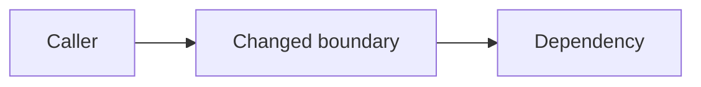

# Design: <Change Title>

Create `design.md` only when the change needs a durable technical choice: cross-module or
cross-service interaction, a new dependency, a security boundary, migration or rollback,
performance or concurrency work, or material implementation ambiguity. Keep observable behavior
in the delta spec. Promote only cross-change architectural decisions to an ADR.

## Context

- Requirement: `REQ-YYYY-NNN`
- Relevant behavior: `BR-<domain>-NNN`
- Current architecture and constraints: TODO
- Material unknowns: TODO

## Goals And Non-Goals

### Goals

- TODO

### Non-goals

- TODO

## Risk Drivers

List only applicable failure risks and the design response for each.

| Driver | Failure mode | Design response |
|---|---|---|
| security / data / contract / concurrency / operations | TODO | TODO |

## Decisions

### Decision: <Title>

- Choice: TODO
- Why: TODO
- Alternatives considered: TODO
- Consequences and trade-offs: TODO
- Promote to ADR: yes / no; reason

## Architecture And Boundaries

Describe ownership, trust boundaries, dependencies, and data flow. Add a diagram only when it
makes the relationship clearer than prose.

## Contracts And Data

- API or event compatibility: not applicable / TODO
- Data model and invariants: not applicable / TODO
- Authorization, privacy, and untrusted input: not applicable / TODO
- Concurrency and idempotency: not applicable / TODO

## Migration And Recovery

- Rollout sequence: TODO
- Backward compatibility window: TODO
- Data migration or backfill: not applicable / TODO
- Rollback trigger and procedure: TODO
- Safe resume point after interruption: TODO

## Operations

- Observability and diagnostics: TODO
- Capacity or performance limits: not applicable / TODO
- Failure handling and degradation: TODO

## Verification Hooks

Identify the interfaces or invariants that can produce acceptance evidence. Do not prescribe a
new test when an existing check, runtime observation, inspection, or captured command is enough.

| Acceptance or Scenario | Useful hook | Risk addressed |
|---|---|---|
| `AC-1` / `SC-<domain>-001` | TODO | TODO |

## Open Questions

- None recorded.
