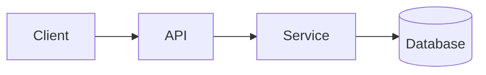
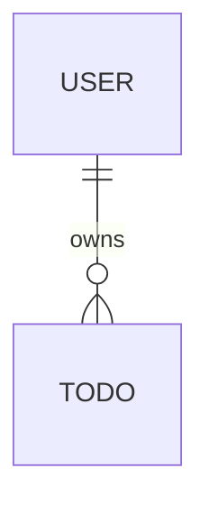
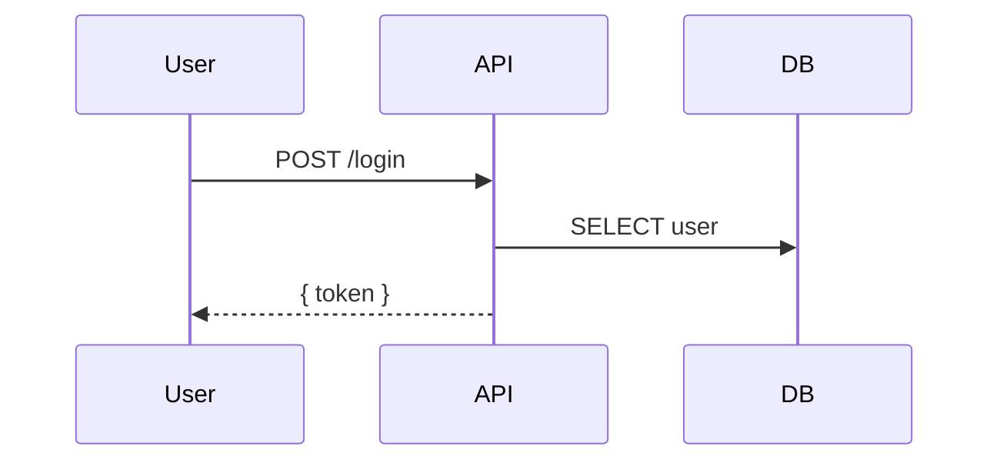

# Design — <Change 标题>

> 复制到 `openspec/changes/<change-id>/design.md`。
> **仅在满足任一条时才写**：跨模块 / 新外部依赖 / 重大数据模型变化 / 安全 / 性能 / 迁移复杂 / 编码前需先做技术决策。否则跳过。
> 聚焦架构与「为什么」，不写逐行实现。说明见 [`references/openspec-model.md`](../references/openspec-model.md) 第三节。

**Change ID**: `<add-team-todo>`
**关联**: [`proposal.md`](./proposal.md) · [`tasks.md`](./tasks.md)

---

## Context

<背景、当前状态、约束、相关方。引用 proposal 的动机、spec 的需求。>

## Goals / Non-Goals

**Goals**
- <这个设计要达成什么>

**Non-Goals**
- <明确不在本设计范围内的>

## 技术栈与依赖

| 维度 | 选型 | 版本 | 理由 |
|------|------|------|------|
| 运行时 | <Node 22 / Python 3.13> | <精确版本> | <...> |
| 框架 | <...> | <...> | <...> |
| 新增依赖 | <pkg> | <最新固定版> | <用途> |

> 依赖锁版规则见 [`references/dev-rules.md`](../references/dev-rules.md) 第 3 条。

## Decisions

> 关键技术选择 + 理由（为什么 X 不选 Y）+ 考虑过的备选。

### Decision: <标题>
<选了什么，为什么。备选 + 放弃原因。>

## 架构概览

### 数据模型（如涉及）

### 关键流程（复杂时画时序图）

## Risks / Trade-offs

| 风险 | 概率 | 影响 | 缓解 |
|------|------|------|------|
| <第三方限流> | 中 | 高 | <缓存 + 重试 + 降级> |

## Migration Plan（如涉及数据/接口迁移）

- <部署步骤、回滚策略、数据迁移演练>

## Open Questions

- [ ] <待解决的技术未知数>
