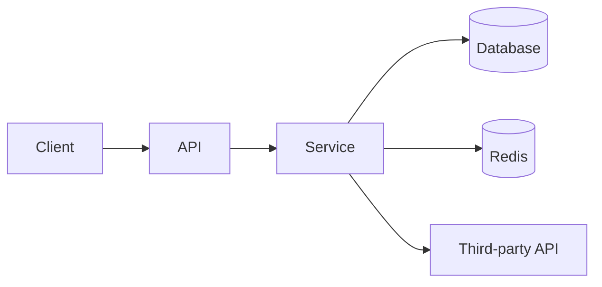
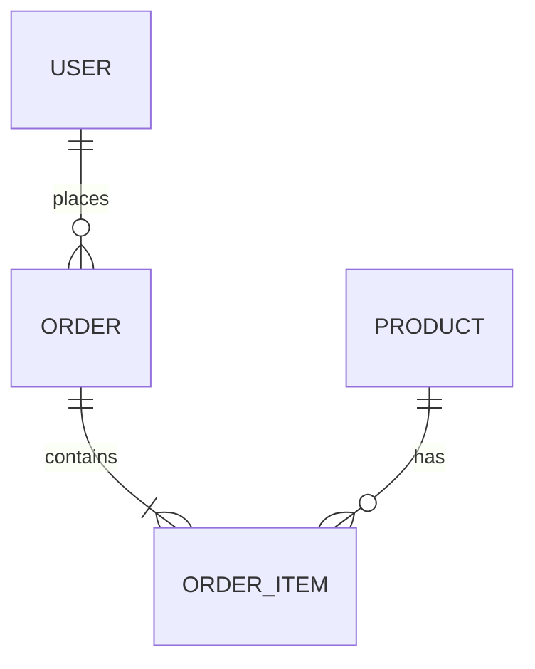
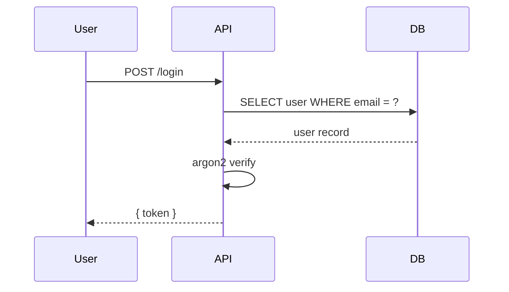

# 需求文档 — <Feature Name>

> 复制本模板到 `docs/<feature-name>/requirements.md`，把所有 `<...>` 占位符替换成真实内容。
> 标记 `[可选]` 的章节按需保留 / 删除。

**版本**: v0.1
**日期**: <YYYY-MM-DD>
**作者**: <user> + AI
**状态**: 草稿 / 评审中 / 已确认 / 实施中 / 已交付
**关联任务列表**: [`tasks.md`](./tasks.md)

---

## 1. 背景

<为什么要做这件事？解决什么问题？谁是受益者？>

<2-3 段，把上下文交代清楚，让接手的人不需要问 "为什么"。>

---

## 2. 目标

### 2.1 范围内 (in scope)

- ✅ <要做的事 1>
- ✅ <要做的事 2>
- ✅ <要做的事 3>

### 2.2 范围外 (out of scope)

- ❌ <这次不做的事 1，但写出来避免误解>
- ❌ <未来可能做但本期不做>

### 2.3 成功标准

<怎么算做完了？> 例如：

- 用户能完成 <主流程> 并且全程不报错
- p95 响应时间 < 200ms
- 上线一周内崩溃率 < 0.1%

---

## 3. 用户场景 / 用户故事

### 3.1 场景 1: <场景名>

**角色**: <e.g. 普通用户 / 管理员>

**前置条件**: <e.g. 已登录、已绑定支付方式>

**步骤**:
1. 用户...
2. 系统...
3. 用户...
4. 系统...

**预期结果**: <e.g. 订单创建成功，跳转到详情页>

**异常分支**:
- 如果支付失败，<...>
- 如果库存不足，<...>

### 3.2 场景 2: <...>
...

---

## 4. 功能需求

每条都要有可验收的"做到怎样算完成"。

### F1: <功能点名称>

**描述**: <一两句话说清楚这个功能是干嘛的>

**输入**: <来自哪、什么形式、什么约束>

**行为**: <核心逻辑步骤>

**输出**: <返回什么 / 副作用 / 状态变化>

**验收标准**:
- [ ] <可验证条件 1>
- [ ] <可验证条件 2>
- [ ] <异常情况的处理>

**关联接口** [可选]:
- `POST /api/...`
- 数据表 `...`

### F2: <...>
...

---

## 5. 非功能需求

### 5.1 性能

- <指标 + 数值>，例如：列表页 p95 < 300ms
- <指标 + 数值>

### 5.2 安全

- 鉴权方案：<JWT / Session / OAuth>
- 敏感数据处理：<加密 / 脱敏 / 不入日志>
- 注入防御：<参数化查询 / 输入校验>

### 5.3 可访问性 (a11y)

- 目标：WCAG 2.1 AA
- 键盘可达 / screen reader 友好 / 对比度 ≥ 4.5:1

### 5.4 国际化 [可选]

- 支持的语言：<zh-CN / en-US / ...>
- 时区 / 货币 / 日期格式

### 5.5 可观测性

- 关键操作打日志 (含 user_id / trace_id)
- 业务指标埋点：<指标列表>
- 错误上报：<Sentry / 自建>

---

## 6. 技术栈与依赖

### 6.1 选型

| 维度 | 选型 | 版本 | 理由 |
|------|------|------|------|
| 运行时 | <Node 22 / Python 3.13 / ...> | <精确版本> | <理由> |
| 框架 | <...> | <...> | <...> |
| 数据库 | <...> | <...> | <...> |
| 关键库 1 | <...> | <最新固定版> | <...> |
| 关键库 2 | <...> | <最新固定版> | <...> |

### 6.2 新增依赖

| 包名 | 版本 | 用途 |
|------|------|------|
| <...> | <精确版本号> | <...> |

### 6.3 环境变量

| 名称 | 必需? | 用途 | 示例 |
|------|-------|------|------|
| `<NAME>` | 是 | <...> | `<...>` |

---

## 7. 架构概览

### 7.1 整体架构图



### 7.2 数据模型



或表格形式：

| 表 | 字段 | 说明 |
|----|------|------|
| `users` | `id, email, ...` | <...> |

### 7.3 关键流程

<复杂流程画时序图>



### 7.4 模块划分

```
src/
├── auth/           ← 鉴权模块
├── payment/        ← 支付模块
├── shared/         ← 共享工具
└── ...
```

---

## 8. 开放风险

| 风险 | 概率 | 影响 | 缓解方案 |
|------|------|------|----------|
| <第三方服务限流> | 中 | 高 | <加缓存 + 重试 + 降级> |
| <数据迁移失败> | 低 | 高 | <预演 + 可回滚 migration> |

---

## 9. 开放问题 / 待用户拍板

- [ ] <问题 1：选 A 还是 B？>
- [ ] <问题 2：是否要支持 X？>
- [ ] <问题 3：上线节奏？>

---

## 10. 参考资料

- <官方文档 url>
- <类似项目 / 相关博客 url>
- <Figma 设计稿 url，如有>

---

## 变更历史

| 日期 | 版本 | 变更 |
|------|------|------|
| <YYYY-MM-DD> | v0.1 | 初稿 |
