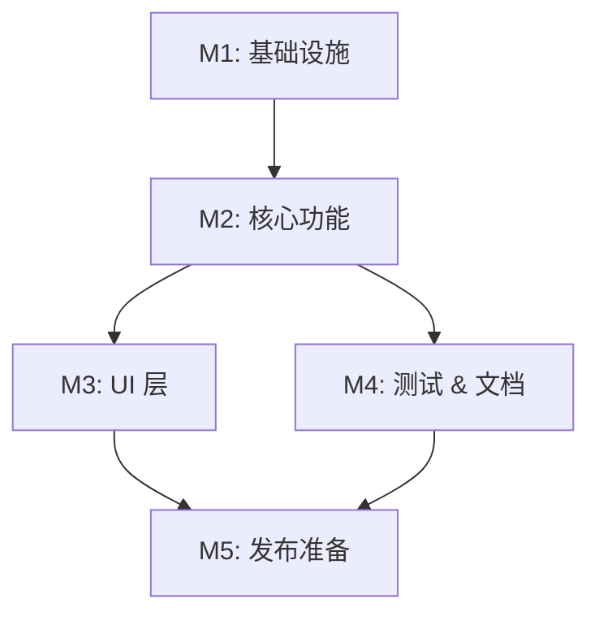

# 任务列表 — <Feature Name>

> 复制本模板到 `docs/<feature-name>/tasks.md`，作为开发期的指挥棒。
> 每个任务开始/结束时都要更新状态 emoji 和备注块。

**关联需求**: [`requirements.md`](./requirements.md)
**估算量级**: 小 / 中 / 超大 (审核轮数：1 / 5 / 10+)
**总体进度**: 🚧 0 / N

---

## 状态图例

| Emoji | 状态 | 含义 |
|-------|------|------|
| ⏳ | 待开始 | 还没开始 |
| 🚧 | 进行中 | 当前正在做 |
| ✅ | 已完成 | 自检通过、commit/push 完毕 |
| ⚠️ | 阻塞中 | 等待外部决策 / 修不动 |
| 🔍 | 待审核 | 自己做完了等用户 review |

---

## 里程碑依赖图

---

## Milestone 1: <里程碑名>

**目标**: <这个里程碑要达成什么>
**依赖**: <无 / 依赖 M0 …>
**状态**: ⏳ / 🚧 / ✅

### Task 1.1 ⏳ <任务名称>

**描述**: <做什么，要清楚到能直接开干>

**依赖**: 无
**阻塞**: T1.2, T1.3

**预估**: <2h>

**关联文件 / 模块**:
- `src/...` (新建)
- `docs/...` (修改)

**验收**:
- [ ] <可验证条件 1>
- [ ] <可验证条件 2>

#### 备注 (开发期由 AI 填写)

- 🐛 **遇到的问题**: <开发中卡了什么？怎么解的？>
- 🔧 **最终实现逻辑**: <核心思路 + 文件位置>
- 🎯 **关键决策**: <选了 A 而不是 B 的理由>

---

### Task 1.2 ⏳ <任务名称>

**描述**: <...>

**依赖**: T1.1
**阻塞**: T2.1

**预估**: <1h>

**关联文件 / 模块**:
- `src/...`

**验收**:
- [ ] <...>

#### 备注

- 🐛 **遇到的问题**:
- 🔧 **最终实现逻辑**:
- 🎯 **关键决策**:

---

### Task 1.3 ⏳ <任务名称>

(同上结构)

---

## Milestone 2: <里程碑名>

**目标**: <...>
**依赖**: M1
**状态**: ⏳

### Task 2.1 ⏳ <任务名称>

#### 子任务

- [ ] **2.1.a** ⏳ <子任务 1>
- [ ] **2.1.b** ⏳ <子任务 2>
- [ ] **2.1.c** ⏳ <子任务 3>

(如果任务有子任务，主任务下用 checkbox + emoji 形式列。子任务全部 ✅ 主任务才能 ✅。)

**描述**: <...>
**依赖**: T1.1, T1.2
**阻塞**: T2.2

**预估**: <4h>

**验收**:
- [ ] <...>

#### 备注

- 🐛 **遇到的问题**:
- 🔧 **最终实现逻辑**:
- 🎯 **关键决策**:

---

### Task 2.2 ⏳ <任务名称>
...

---

## Milestone 3: <里程碑名>

(继续按需添加)

---

## 进度总览 (开发中实时维护)

| 里程碑 | 任务 | 完成 | 总数 | 状态 |
|--------|------|------|------|------|
| M1 | 基础设施 | 0 | 3 | ⏳ |
| M2 | 核心功能 | 0 | 5 | ⏳ |
| M3 | UI 层 | 0 | 4 | ⏳ |
| M4 | 测试 & 文档 | 0 | 2 | ⏳ |
| M5 | 发布准备 | 0 | 1 | ⏳ |
| **总计** | | **0** | **15** | **⏳** |

---

## 变更记录

| 日期 | 变更 |
|------|------|
| <YYYY-MM-DD> | 初稿，N 个任务 |
| <YYYY-MM-DD> | T2.1 拆成三个子任务 |

---

## 最终审核索引 (Phase 4 期间填)

| Round | 视角 | 状态 | 报告 |
|-------|------|------|------|
| 1 | 功能 | ⏳ | <-> |
| 2 | 类型 & 静态分析 | ⏳ | <-> |
| 3 | 性能 | ⏳ | <-> |
| 4 | 安全 | ⏳ | <-> |
| 5 | UX & a11y | ⏳ | <-> |
