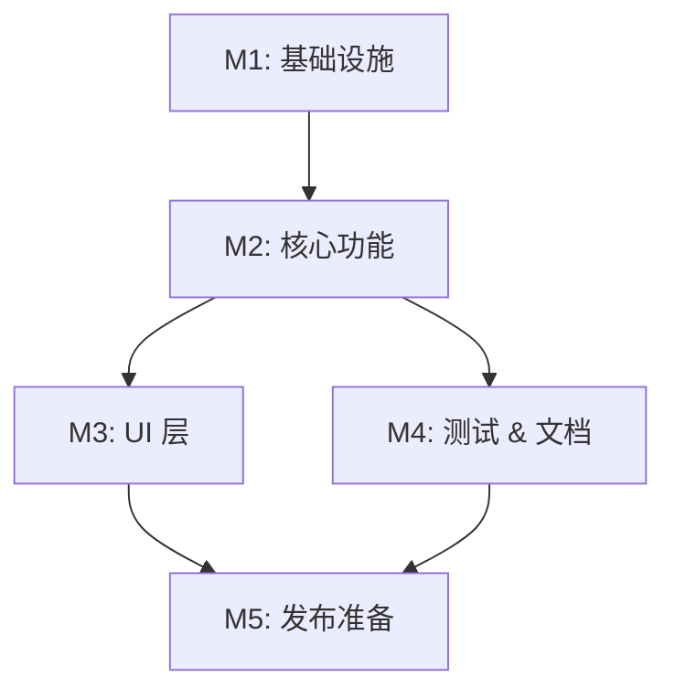

# 任务列表 — <Change 标题>

> 复制到 `openspec/changes/<change-id>/tasks.md`，作为开发期的指挥棒，也是断点续做的真相源。
> 每个任务开始/结束都更新状态 emoji 和备注块（见 [`references/context-and-agents.md`](../references/context-and-agents.md)）。

**关联**: [`proposal.md`](./proposal.md) · [`spec.md`](./specs/) · [`design.md`](./design.md)
**级别**: Lite / Standard / Full

---

## 状态图例

| Emoji | 状态 | 含义 |
|-------|------|------|
| ⏳ | 待开始 | 还没开始 |
| 🚧 | 进行中 | 当前正在做（断点续做从这里接） |
| ✅ | 已完成 | 自检通过、测试通过、commit 完毕 |
| ⚠️ | 阻塞中 | 等待外部决策 / 修不动 |
| 🔍 | 待审核 | 自己做完等用户 review |

---

## 里程碑依赖图

---

## Milestone 1: <里程碑名>

**目标**: <达成什么>
**依赖**: <无 / M0>
**状态**: ⏳

### Task 1.1 ⏳ <任务名称>

**描述**: <清楚到能直接开干>

**实现 Requirement**: <R-auth-1（用户认证）—— 关键的需求追溯，确保每条 Requirement 都被某任务覆盖>
**依赖**: 无 ｜ **阻塞**: T1.2, T1.3

**关联文件 / 模块**:
- `src/...` (新建)

**验收**:
- [ ] <对照 spec scenario 的可验证条件>
- [ ] 对应 scenario 的自动化测试已写且通过

#### 备注（开发期由 AI 填写）

- 🐛 **遇到的问题**: <卡了什么？怎么解的？>
- 🔧 **最终实现逻辑**: <核心思路 + 文件位置>
- 🎯 **关键决策**: <选了 A 不选 B 的理由>

---

### Task 1.2 ⏳ <任务名称>

**描述**: <...>
**实现 Requirement**: <R-...>
**依赖**: T1.1 ｜ **阻塞**: T2.1

**验收**:
- [ ] <...>

#### 备注
- 🐛 **遇到的问题**:
- 🔧 **最终实现逻辑**:
- 🎯 **关键决策**:

---

## Milestone 2: <里程碑名>

**目标**: <...> ｜ **依赖**: M1 ｜ **状态**: ⏳

### Task 2.1 ⏳ <任务名称>

#### 子任务
- [ ] **2.1.a** ⏳ <子任务 1>
- [ ] **2.1.b** ⏳ <子任务 2>

（有子任务时主任务下用 checkbox + emoji 列；子任务全 ✅ 主任务才能 ✅。）

**描述**: <...>
**实现 Requirement**: <R-...>
**依赖**: T1.1, T1.2 ｜ **阻塞**: T2.2

**验收**:
- [ ] <...>

#### 备注
- 🐛 **遇到的问题**:
- 🔧 **最终实现逻辑**:
- 🎯 **关键决策**:

---

## 里程碑进度（派生自上面各任务状态，里程碑边界时刷新——不逐任务维护，避免与上面打架）

| 里程碑 | 状态 | 备注 |
|--------|------|------|
| M1 基础设施 | ⏳ | |
| M2 核心功能 | ⏳ | |
| M3 UI 层 | ⏳ | |

> 真相是上面每个任务的 emoji；本表只是里程碑级速览。

---

## 需求覆盖自查（写完任务列表时过一遍）

| Requirement | 覆盖任务 |
|-------------|----------|
| R-auth-1 用户认证 | T1.1, T1.2 |
| R-auth-2 会话过期 | T1.3 |
| ... | ... |

> 有没有哪条 Requirement 一个任务都没覆盖？有就补任务。（闭环见 [`references/openspec-model.md`](../references/openspec-model.md) 第七节）

---

## 审核索引（Phase 4 期间填，视角与波数按级别，见 final-review.md）

| 波 | 视角 | 状态 | 报告 |
|----|------|------|------|
| 1 | 功能正确性 | ⏳ | <-> |
| 1 | 类型 & 静态 | ⏳ | <-> |
| 1 | 性能 | ⏳ | <-> |
| 1 | 安全 | ⏳ | <-> |
| 1 | UX & a11y | ⏳ | <-> |

---

## 变更记录

| 日期 | 变更 |
|------|------|
| <YYYY-MM-DD> | 初稿，N 个任务 |
